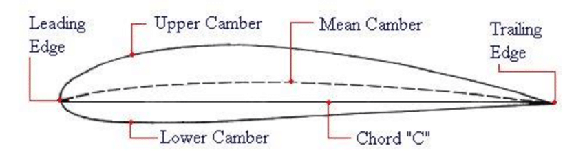
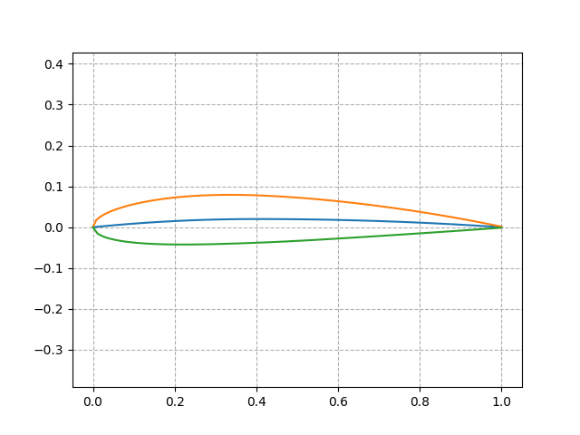

# AirfoilNACA
## Video Demo:  <URL HERE>
#### Name: José de Jesús Hernández Ibarra
#### Github: codejogy
#### Edx: codejogy
#### México, Guanajuato, Irapuato
#### Date: 11/02/24
## Description:

AirfoilNACA is a python project aims to make NACA 4 digits airfoils.

The intention of this project is to empower aeronautics engineers with the capacity to make their own airfoils using the classic function of NACA 4 digits.
#### What is the utility of this? 
Usually, airfoils simulations give data to see how efficient is an airfoil, with parameters as, drag, lift coefficient, drag coefficient and lot of other data that is practical for an airship as a whole.

Given the 4 digits the user obtains a folder with a graph of the airfoil and a CSV with the values x and y used to make the graph. It was made directly with the defined equations NACA 4 digits requires to make it portable and web-free.

#### Challenges

The first big challenge was to understand how the equations works, if I couldn't understand it, I wouldn't be able to troubleshoot any wrong values from the function.

This was the first time I used matplotlib, but, getting plot images wasn't that challenging, after all, it's a display of y in a x.

The structure this project was developed is functionality before CLI

## Functionality
Output useful airfoil data was essential to make this project useful for other people, in order to get that in code, the first thing done was to separate the function as a whole into tiny functions for further expansion.
### Assumptions
The cord starts in x = 0 and ends in x = 1, everything depends on this assumption, so, the program gets a lot of divisions from 0 to 1 for the sake of graph smoothness. The number of divisions will be called samples.


- `xValues()`
    
    Outputs a list for a given number of samples, by default the function gives 100 divisions from 0 to 1.

- `meanCamberLine()`

    Outputs the mean camber line $y_c$ in a list for the given x values. 

- `thicknessDistribution()`

    Outputs the thickness distribution $y_t% in a list for the given x values.

- `thetaValues()`

    Outputs the theta values (angle) of the mean camber line for any given x. In other words, outputs the arctan of $\frac{d y_c}{dx}$ for the given x values.

- `upperSurface()`

    Outputs in the CSV and the graph the upper surface values $x_U, y_U$ for the given x values.

- `lowerSurface()`

    Outputs in the CSV and the graph the lower surface values $x_L, y_L$ for the given x values.

For detail explanation of the math. [Credits](#credits).

Once the program is able to give a list of x and y values for any given 4 digits, E.g 2412, is time to give the user meaning to the data.

## CLI 
CLI is the interface selected, so the author can get used to CLI by making it, and, the customization CLI offers is great, also, developers sometimes are more used to it.

#### How it works?
The user needs to start the python program and give the 4 digits number to the command line. E.g 

`python project.py 2412`

This will give the user in a folder with the name NACA2412 two files, NACA.png and NACA.csv

- `mkdir()`

    Makes a directory in the folder where project.py stands, the name of the dir is NACA####. Outputs True if done, but if there's already a folder with that name, doesn't do anything and outputs False.

- `nacaParser()`

    Check if the given argument is valid, it has to be from 0001 to 9999 (also accepts 1 instead of 0001).

- `getImage()`

    Once the upper and lower surfaces are gotten, an image extension .png will be generated displaying the upper and lower surfaces in a single graph.

- `getCSV()`

    Once the upper and lower surfaces are gotten, a CSV file will be generated giving the x and y values of upper surface, then lower surface, from $x = 0$ to $x = 1$

- `main()`

    This function gives a sequence for all the functions declared before. First, parsing the input from CLI, then, checking for errors in the input, after, computing the function for the given input, finally, outputs in a folder the image of how that airfoil looks, and a CSV with the values.

## How to use the project
The version of Python this project was made is 3.10, take that in consideration if any error occurs.

In the CLI of with the project folder as the root.

```
$ python project.py -h
```
This flag will give all the functionality the program offers
## Examples
```
$ python project.py 2412
```
Will output if everthing goes OK
```
Success, check your new folder!
```
Now checking the new folder NACA2412 there is



and the CSV file with values as

| x         | y         |
|-----------|-----------|
| 0.0       | 0.0       |
| 0.0083467 | 0.0179442 |
| 0.027384  | 0.031682  |
| ...       | ...       |

If you want to get more samples of the CSV, you can use the -s argument

`python project.py 2412 -s 500`

Now you get more than 500 divisions instead of the 100 the program uses by default.

## Design choices
At the beginning, I was thinking in only using a plot to output how the airfoil would look, but after some testing in CS50 codespace and WSL I realized using a new window as output was a hard task, then, I decided to make it more friendly to the codespace and giving more user functionality saving the image and adding a CSV instead of just giving an output in a new window.


## Knowledge acquired
- Introduction to matplotlib
- Built-in function range() doesn't make a range for floats
- Numpy would make this program faster, but found about it later in the process.
- Documentations techniques in python files
- Type hints 


## Credits

https://aerospaceweb.org/question/airfoils/q0041.shtml

https://www.makeareadme.com/

https://www.freecodecamp.org/news/how-to-write-a-good-readme-file/